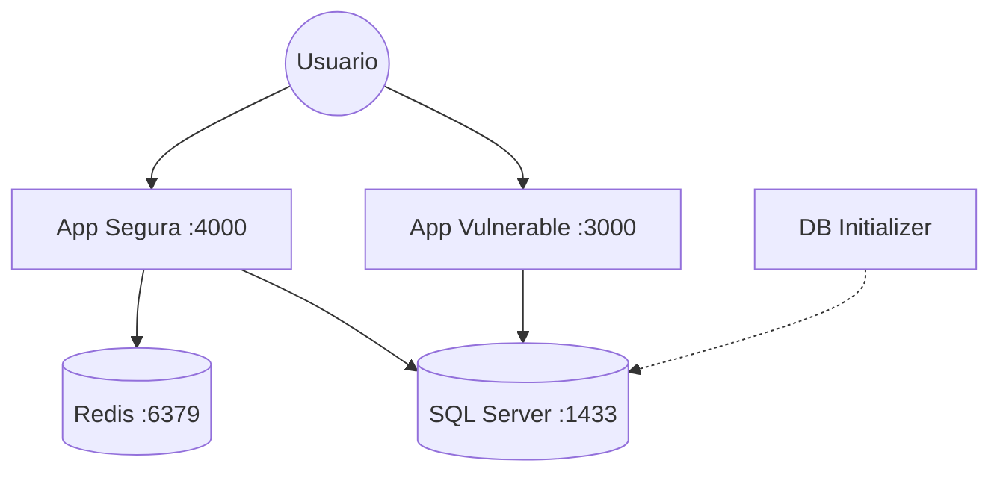

# 🛠️ KMATA – SQL Injection Lab (Premium Edition)

Este laboratorio académico es una plataforma interactiva diseñada para demostrar, explotar y mitigar vulnerabilidades de **SQL Injection** utilizando tecnologías modernas de nivel empresarial.

---

## 🚀 1. Características Principales

Este lab no es solo un script; es un ecosistema completo que incluye:

*   **⚡ Doble Aplicación**: Una versión vulnerable (v1) y una versión asegurada (v2) corriendo simultáneamente.
*   **💾 Base de Datos SQL Server**: Contenedor oficial de Microsoft SQL Server 2022.
*   **🏎️ Performance con Redis**: Cache de sesiones y resultados en la versión segura para demostrar optimización.
*   **📊 Logging Estructurado**: Implementación de **Winston** para logs profesionales en formato JSON.
*   **🏥 Health Checks**: Sistema de monitoreo de salud que asegura que los servicios solo arranquen cuando sus dependencias (DB, Cache) estén listas.
*   **🔄 Auto-Initialization**: Script de base de datos automático mediante `db-init`.

---

## 🏗️ 2. Arquitectura del Sistema



---

## 🛠️ 3. Requisitos Previos

*   [Docker Desktop](https://www.docker.com/products/docker-desktop/) (con soporte para Compose)
*   Powershell (recomendado en Windows 11)

---

## 🏁 4. Cómo Levantar el Laboratorio

Desde la raíz del proyecto, ejecuta el siguiente comando:

```powershell
docker compose up -d --build
```

### ¿Qué sucede durante el despliegue?
1.  **SQL Server** se inicia y configura su entorno.
2.  **Redis** se levanta para servir como capa de cache.
3.  **db-init** espera a que SQL Server esté saludable y ejecuta `kmata_lab.sql`.
4.  **Apps (v1 & v2)** se inician solo después de que la DB y el Cache responden correctamente.

---

## 🔓 5. Fase I: Explotación (v1-vulnerable)

**URL**: [http://localhost:3000](http://localhost:3000)

### Escenario de Ataque Manual
1.  Haz clic en el botón **💡 Ayuda**.
2.  Prueba el login legítimo: `admin` / `admin123`.
3.  Intenta el **Bypass de Autenticación**:
    *   **Usuario**: `' OR 1=1 --`
    *   **Password**: (cualquier cosa)
    *   **Resultado**: ¡Acceso concedido sin conocer la contraseña!

### Explotación Automatizada con sqlmap
Si tienes `sqlmap` instalado, puedes extraer la base de datos completa:

```bash
python sqlmap.py -u "http://localhost:3000/auth/login" --data="username=admin&password=123" --method=POST -p username --dump --batch
```

---

## 🛡️ 6. Fase II: Seguridad (v2-secure)

**URL**: [http://localhost:4000](http://localhost:4000)

### Mejoras de Seguridad Implementadas
*   **Consultas Parametrizadas**: Uso de `@username` y `@password` para separar datos de la lógica SQL.
*   **Sanitización de Entrada**: Validación de longitud y tipos de datos.
*   **Manejo Seguro de Errores**: No se filtran detalles técnicos al cliente.

### Características Premium
*   **Cache de Cache**: Resultados exitosos se guardan en **Redis** por 60s. Verás el mensaje `(cached)` en respuestas rápidas.
*   **Logs JSON**: Los intentos de login se registran con Winston. Puedes verlos con:
    ```powershell
    docker logs kmata_v2
    ```

---

## 🧪 7. Comparación Técnica

| Característica | Versión Vulnerable | Versión 2.0 Segura |
| :--- | :--- | :--- |
| **Construcción SQL** | Concatenación Directa | **Parametrización (SQL Prep)** |
| **Protección SQLi** | ❌ No | ✅ Sí (Completa) |
| **Performance** | ❌ Directo a DB | ✅ **Redis Cache Layer** |
| **Observabilidad** | Console.log básico | ✅ **Winston JSON Logging** |
| **Disponibilidad** | Arranque simple | ✅ **Docker Healthchecks** |

---

## 🧹 8. Limpieza y Reinicio

Si deseas borrar todo rastro (incluyendo datos de la base de datos) para empezar de cero:

```powershell
docker compose down -v
```

---

## ✍️ Autores
*   **kmata** - Desarrollo Original
*   **Antigravity AI** - Optimizaciones Premium y Seguridad

---
*Este laboratorio es estrictamente para fines educativos. No utilices estas técnicas en sistemas sin autorización.*
